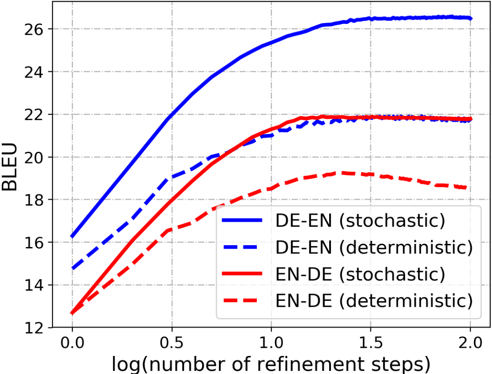



During a master's project, supervised by [Evegeniia Tokarchuk](https://evgeniia.tokarch.uk/) in late 2022, we came across an interesting result that (for various reasons) I never got around to writing up and publishing. This post is meant to make up for that.

The goal of machine translation, similar to standard language modelling, is to estimate a probability distribution over possible continuations of a target string, $y_t$, conditioned on a source string $x$ and all preceding target string context, $y_{t-}$. Naturally, it is assumed that strings $x$ and $y$ are in different languages.

Symbolically we can reduce this to $$
p_{\theta}(y_t|x, y_{t-})
$$
where $\theta$ corresponds to the architecture we're using. With *neural* machine translation systems, the predominant architectural structure is an encoder-decoder system; the encoder takes the soure text $x$ and encodes it, $f_{\theta}^{\text{(enc)}}(x)$, while the decoder takes as input the encoded source text and the preceding target text, $f_{\theta}^{\text{(dec)}}(y_{t-},f_{\theta}^{\text{(enc)}}(x))$.

Encoding the source text can[^can] occur relatively quickly, as it is sequence length independent. Short or long, we only need to pass the source text through our model once. This is not the case for decoder at inference time. To sample a translation, we have to produce each token, from beginning to end, and append each continuation to $y_{t-}$ to form the context for the next continuation: $p_{\theta}(y_{t+1}|x, y_{t-}\cup y_{t})$. This is called auto-regression, a situation where each step depends on the model's output at previous steps.

[^can]: here the word *can* is operative, as common models do see some form of auto-regression during encoding. I'm trying to stay model agnostic for now

As a result, the decoding process takes $T$ more compute steps to complete, relative to encoding. For example, to translate all text written so far, I'd have to run the model at least ~300 times. Sub-word tokenization is only going to exarcabate this issue.

For now, that it a cost we're just going to have to swallow, although it's most likely the single largest contributor to OpenAI's [eye-watering](https://www.businessinsider.com/how-much-chatgpt-costs-openai-to-run-estimate-report-2023-4?international=true&r=US&IR=T) overhead for running GPTx.

But it doesn't have to be this way. If we can remove or at least restrict the dependency on $y_{t-}$, we can remove the dependency on the target sequence length $T$, and produce (good??) translations at the same cost of encoding the source text. Impossible? Maybe for some, but not for non-autoregressive transformers (NAT).

## The Promise of Non-Autoregressive Transformers

Transformers are inherently *not* autoregressive models. To allow it become autoregressive, we have to 'trick' it during training time, by masking all antecedent context, $y_{t+}$, a process called 'causal masking' or 'causal decoding'. Encoder only language models, like BERT , get around this by using masked language modelling. Instead of requesting the model completes the string as

> Grad student descent is the best gradient ...

We only ask that it fills in the masked tokens, allowing the model to draw upon context both before and after the unknown segments of text

> Grad \<MASK\> descent is the best \<MASK\> descent method.

The explosive popularity of BERT and its descendants is proof enough that unsupervised learning in this manner is sufficient for (some form of) natural language understanding. Slightly predating these models, is the work of Lee et al.  who use this approach to implement a non-autoregressive transformer for NMT[^denoising].

[^denoising]: this form of masking and learnt unmasking can be seen as a specific form of denoising, a concept Lee et al.  specifically reference. Denoising has been around for a while, and with diffusion models, has hit the mainstream in areas other than NLP

At inference time, their models perform two steps. First, they predict the sequence length of the target text,$$\hat{T}\sim p_{\theta}(T|x)$$ and then sample $\hat{T}$ tokens from $$\hat{y}_{0}\sim_{\hat{T}} p_{\theta}(y|x, \emptyset)$$

Rather understandably, $\hat{y}_{0}$ tends to be poor. Each of the $\hat{T}$ tokens was sampled without known anything about the other tokens, other than their existence (hence the conditioning on $\emptyset$). In order to produce better translations, Lee et al.  propose iterative refinement. Just repeat the decoding process $i_{\text{dec}}$ times, using the preceding generation as a conditioning element, $$\hat{y}_i\sim_{\hat{T}} p_{\theta}(y|x, \hat{y}_{i-1})$$

At each step, the translation has access to better and better base translations, and tends to improve. This process does saturate though, tend to reach an inflection point at 10 steps. Anything beyond that results in marginal gains.

<!--  -->

As long as $i_{\text{dec}}\ll T$, this is still a much faster decoding process than autoregressive decoding... just not necessarily better. Ultimately, the quality of the translations is key, and especially at low $i_{\text{dec}}$, this lags substantially behind identical autoregressive models. Ever since, NATs have been playing cath-up with the autoregressive counterparts, trying to improve their inference time *quality* while maintaining their speed.

## Exposure Bias or Why Models Can't Understand Themselves

The discussion has so far focused on inference time applications of NMT models. At inference time we do not have access to the ground truth translation (duh!), precisely because we're trying to generate them. This generation is usually more complex than simply sampling from the produced distribution, requiring a *decoding algorithm*. At training time, however, we do have access to those ground truth tranlations, and use those to create a learning signal for the model (no decoding algorithm necessary). During training, the model is thus never *exposed* to the output it produces, only the idealised output.

As a result, models perform worse at inference time. While we train the model's token distribution to approximate, as best it can, the ground-truth distribution, decoding algorithms usually alter these distributions to find *sequences* of high probability[^inadequacy_of_the_mode]. In other words, the model's training objective does not align with its decoding algorithm. When we feed the tokens from the decoding algorithm back into the model, we essentially get a form of domain shift. This problem is somewhat infamous, and is called the exposure bias .

[^inadequacy_of_the_mode]: this chasing of the mode brings with it a whole host of other problems. See Eikema, B., & Aziz, W., "Sampling-Based Approximations to Minimum Bayes Risk Decoding for Neural Machine Translation," 2021. Available: [https://arxiv.org/abs/2108.04718](https://arxiv.org/abs/2108.04718).

### Mitigating Exposure Bias

We would ideally like to minimize, or at least mitigate, this exposure bias. Wang & Sennrich  and later Kiegeland & Kreutzer  achieve this by adding a minimum risk training component to the training process.

Minimum Risk Training (MRT) has been around for while. It leverages a techique from reinforcement learning[^reinforce] to get a learning signal from a potentially undifferentiable risk function. By aligning the risk function with our decoding algorithm, we can introduce the model to its own output after utilising an undifferentiable decoding algorithm.

Specifically, if we sample $K$ candidate translation from the decoding algorithm applied to our model, $\tilde{y}_{k}$, we can approximate our gradient as, $$\nabla \mathbb{E}\left[R(\tilde{y}, y)\right]\approx\frac{1}{K}\sum_{k=1}^K R(\tilde{y}_k, y)\log p_{\theta}(\tilde{y}|x)$$ where $R(\tilde{y}_k, y)$ is a risk function which provides high scores when $\tilde{y}_k$ is poor and low scores when it is good. An NMT example of a risk function could be the complement of the BLEU score, $1-\text{BLEU}(\tilde{y}_k, y)$.

## Improving NATs

NATs with iterative refinement likely suffer from this exposure bias too. During training, it is only exposed to the masked language modelling objective, which tries to pull the model's output distribution closer to the ground truth distribution. At inference time, though, we use iterative refinement as a decoding algorithm to gradually build and improve our candidate translation. Since these processes can differ quite a bit, it is plausible that exposure bias is present in NATs.


### Implementation

```python
while not converged:
  # Sample x, y, T from the dataset
  batch = next(dataloader)
  x, y, T = *batch

  # MLM training ====================================================
  # Corrupt y
  mask = generate_mask(T)
  y_corrupt = corrupt(y, mask)

  # Perform forward pass with model on corrupted target sequence
  # Essentially asks model to correct the corruptions
  p_y, p_T = model.forward(x, y_corrupt)

  # Compute MLM objective
  # Only computes on tokens that were corrupted
  mlm_loss = model.compute_loss(p_y, y, p_T, T, mask)

  # MRT training ====================================================
  # Sample K hypotheses translations for each batch sample
  y_samples = model.select(x)

  # Compute the risk
  # Include baseline for variance reduction
  risk = compute_risk(y_samples, y) - risk_baseline(y_samples)

  # Select the probability of the choices made by the decoding
  # algorithm. How likely were the proposed corrections?
  p_y_select = p_y[y_samples]

  # Compute the MRT using REINFORCE trick
  mrt_loss = torch.mean(risk * torch.log(p_y_select))

  # Backward Pass ===================================================
  # Mix the losses together
  loss = alpha * mrt_loss + (1 - alpha) * mlm_loss

  # Compute the gradient and update
  model.backward(loss)
  optimizer.step()
```

Base on the pseudo-code above, we essentially have 5 degrees of freedom when experimenting:
1. `select`: the method for converting the probability of tokens to a single token. This could be sampling, sampling with temperature, taking the mode (i.e. argmax) or any of a variety of decoding algorithms (top-k, nucleus sampling, etc.)
2. `compute_risk`: the risk function. For this task, we want to compare two sentences on their translation quality. We chose BLEU, GLEU, ChrF2++. All of these are relatively cheap to compute, but in theory we could use more expensive methods like COMET, BLEURT, etc.
3. `risk_baseline`: a method for estimating the baseline risk. Can reduce the variance of the risk, accelerating training. Methods for computing this baseline could include a running mean or a separate critic model. In our case, this gives the benefit of increasing the strength of the learning of very good or very poor translations, while minimizing those close to baseline
4. `alpha`: the mixing coefficient. Some value in the range $[0, 1]$, where higher values indicate preference for MRT training over MLM training. A score of 0.5 balances the two
5. `K`: the number of hypotheses to sample using `select`

## Results

### MRT does not hurt performance

First things first, we want to make sure the add MRT fine-tuning does not harm the underlying model. The following table presents the results after fine-tuning with MRT and a variety of risk functions. We also include 3 baselines: i) the pre-trained NMT model, ii) the model fine-tuned with MLM *but not MRT* and iii) the model fine-tuned with a constant risk function. All models were trained with $\alpha=0.5$ and multinomial sampling. For now, we've kept $i_{\text{dec}}=10$. Essentially, this evaluation is meant to emulate evaluation *under the best possible scenario for the pretrained baseline*.

| Model      | BLEU             | ChrF2++          | GLEU             | COMET           |
| ---------- | :--------------: | :--------------: | :--------------: | :-------------: |
| Pretrained | 29.32            | 55.13            | 32.90            | 0.21            |
| Finetuned  | 29.37 ± 0.06     | 55.35 ± 0.08     | 33.08 ± 0.07     | **0.22 ± 0.01** |
| Constant   | 29.30 ± 0.10     | 55.48 ± 0.08     | **33.10 ± 0.08** | 0.22 ± 0.00     |
| BLEU       | **29.55 ± 0.02** | **55.60 ± 0.05** | **33.24 ± 0.03** | **0.23 ± 0.01** |
| GLEU       | 29.45 ± 0.04     | 55.49 ± 0.09     | **33.15 ± 0.06** | 0.22 ± 0.00     |
| CHRF2++    | **29.58 ± 0.15** | **55.60 ± 0.04** | **33.24 ± 0.06** | **0.23 ± 0.00** |

The columns give various corpus-level NMT quality estimates and their standard error. These metrics all have a different central tendency, and should not be compared against each other. I've bolded the maximum value per column, and any value whose mean + 2 std. errors is within the maximum.

We can already draw two conclusions:
1. MRT finetuning at the very least does not hurt performance at $i_{\text{dec}}=10$, and in fact, looks to slightly improve it
2. The actual choice of metric does not seem to matter so much, although a noisy metric (Constant) hurts a little

### MRT finetuning can significantly speed up decoding

The following table provides a slightly different view. Here all MRT models are trained with `argmax` sampling and BLEU as the risk function. Two baselibes are considered, the same as earlier. Rather than just measuring performance, we focus on the ChrF2++ score, and how many refinement iterations each model needs to reach its maximum score. We also show how steps are needed to beat the pre-trained model. The fewer steps, the better.

| Model         | Maximum          | Iterations | Iterations Pretrained |
| ------------- | :--------------: | :--------: | :-------------------: |
| Pretrained    | 55.26            | 8          | 8                     |
| Finetuned     | 55.53 ± 0.06     | 8          | 6                     |
| $\alpha=0.50$ | **55.74 ± 0.07** | 8          | 5                     |
| $\alpha=0.60$ | 55.64 ± 0.09     | 10         | 5                     |
| $\alpha=0.70$ | **55.79 ± 0.05** | 8          | 5                     |
| $\alpha=0.75$ | **55.86 ± 0.04** | 7          | **4**                 |
| $\alpha=0.80$ | 55.62 ± 0.00     | **5**      | 5                     |
| $\alpha=0.90$ | 55.55 ± 0.08     | 8          | 5                     |

Where the table in [the previous](#mrt-does-not-hurt-performance) details performance in the best-case scenario for the pre-trained and fine-tuned models, here we let each model iterate to its maximum. Across the board, the MRT models perform better, and can reach those better scores faster, and significantly faster than the pre-trained model. In this case, and $\alpha=0.75$ value seems optimal, achieving the best ChrF2++ score *and* doing so in half as many steps as the original pre-trained model. The same conclusions hold when looking at other NMT metrics.

## References


