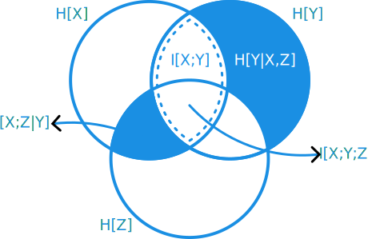
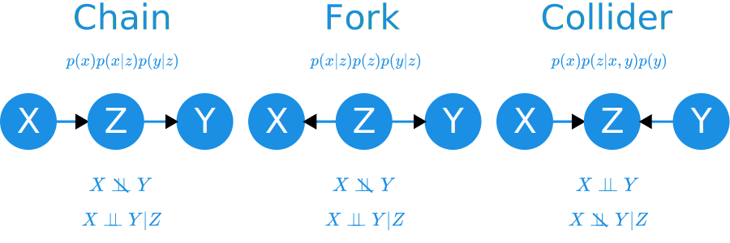
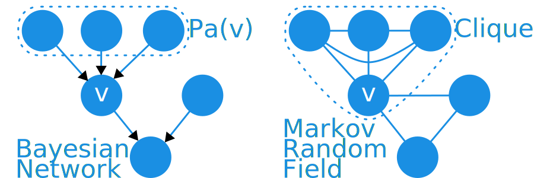



This document contains a (very) condensed variant of notes I took for the 2021 edition of [UvA's Machine Learning 2 course](https://coursecatalogue.uva.nl/xmlpages/page/2021-2022-en/search-course/course/89422). While none of the methods we discussed are 'SoTA' any more, this course was one of the best I've ever had the privilege of taking. The emphasis on bi-weekly exams, meant that besides my lecture notes I also made a lot of summaries. The following is a computer friendly transcription of those summaries.

## Exponential Families

We can define many distributions as an instance of the **exponential family**,
$$p(x|\eta)=h(x)\cdot\exp\{\eta^\intercal T(x)-A(\eta)\},$$
where $\eta$ is a vector of natural parameters, $T(x)$ a vector of sufficient statistics, $h(x)$ a base measure and $A(\eta)$ is the log-partition function (normalizing constant). Wikipedia has a [nice, long table](https://en.wikipedia.org/wiki/Exponential_family#Table_of_distributions) of distributions rewritten in exponential family form.

<!-- As an example, take the eponymous exponential distribution, over $x\in [0, \infty)$ parameterized by $\lambda > 0$,
$$\text{Exp}(x|\lambda)=\lambda e^{-\lambda x}.$$
The exponential family representation can then be defined as,
$$\begin{align}
\eta=-\lambda,\qquad&T(x)=x \\
A(\nu)=-\log(-\eta),\qquad&h(x)=\mathbb{1}(x>0)
\end{align}$$ -->

To find the n-th order moment of the distribution, we need only take the n-th order gradient of the log-partition function w.r.t. the natural parameters: $\nabla_{\eta}^{(n)}  A(\eta)$.

Exponential family distributions all allow for specifying conjugate prior distributions, allowing for a simple Bayesian updating scheme. Let
$$ p(\eta| \tau, \nu ) \propto \exp \{\eta^\intercal\tau - \nu\cdot A(\nu)\} $$
be a prior distribution with *hyperparameters* $\tau$ and $\nu$. The posterior distribution is then parameterized by,
$$\begin{align}
\tau &\rightarrow \tau + \sum_{n=1}^N T(x_n), \\
\nu &\rightarrow \nu + N,
\end{align}$$
where $N$ is the sample size. We get estimates for the natural parameters by,
$$\begin{align}
    \eta^{(\text{MLE})}&=(\frac{\partial}{\partial \eta}A(\eta))^{-1}(\frac{1}{N}\sum_{n=1}^N T(x_n)), \\
    \eta^{(\text{MAP})}&=(\frac{\partial}{\partial \eta}A(\eta))^{-1}(\frac{1}{N+\nu}(\sum_{n=1}^N T(x_n)+\tau)).
\end{align}$$

The [entropy](#information-theory) of an exponential family distribution is,
$$ H[p(x)]=A(\eta)\eta^\intercal\nabla_{\eta} A(\eta) - \mathbb{E}_{p(x)}[\log h(x)], $$
and the [KL-divergence](#information-theory) between two such distributions is,
$$ \mathcal{D}_{\text{KL}}(\eta_{1}\|\eta_{2})=A(\eta_2)-(\eta_1-\eta_2)^\intercal\nabla_{\eta_1}A(\eta_1) - A(\eta_1). $$

## Conditional Independence

A **marginal** probability distribution can be constructed from a joint probability distribution by integrating over all other variables,
$$ p(z)=\int_{x, y}p(x, y, z) \mathrm{d}x\mathrm{d}y.$$

A **conditional** probability distribution is constructed from the ratio of the joint to the marginal, as,
$$ p(x,y|z)=\dfrac{p(x, y, z)}{p(z)}. $$

To 'marginalize' over the conditioning variable, you can take the expectation,
$$ p(x, y) = \mathbb{E}_{p(z)}\left[p(x,y|z)\right]. $$

We consider two distributions independent if $p(x, y)=p(x)\cdot p(y)$.

**Conditional independence**, instead, is defined as,
$$ p(x | y, z) = p(x | y),$$
or, put otherwise, given $y$, variable $z$ provides no additional information about $x$, and can be safely omitted. We denote this as $X \perp\!\!\!\perp Z | Y$[^conditional_indep]. Conditional independence has the [following properties](https://en.wikipedia.org/wiki/Conditional_independence#Rules_of_conditional_independence),

[^conditional_indep]: I got it work in MathJax using the follow snippet `\perp\!\!\!\perp`. It quickly gets annoyingly verbose.

| Name          | Property                                                                                                           |
| ------------- | :----------------------------------------------------------------------------------------------------------------: |
| Redundancy    | $ X \perp\!\!\!\perp Y \mid X $                                                                                    |
| Symmetry      | $ X \perp\!\!\!\perp Y \mid Z \Rightarrow Y \perp\!\!\!\perp X \mid Z $                                            |
| Decomposition | $ X \perp\!\!\!\perp (Y, W) \mid Z \Rightarrow X \perp\!\!\!\perp Y \mid Z $                                       |
| Weak Union    | $ X \perp\!\!\!\perp (Y, W) \mid Z \Rightarrow X \perp\!\!\!\perp W \mid (Z, Y) $                                  |
| Contraction   | $X\perp\!\!\!\perp W \mid (Y, Z) \wedge X \perp\!\!\!\perp Y \mid Z \Rightarrow X \perp\!\!\!\perp (Y, W) \mid Z $ |

We can summarize the last three rows succinctly as,
$$ X \perp\!\!\!\perp (Y, W) | Z \Leftrightarrow X \perp\!\!\!\perp W | (Y, Z) \wedge X \perp\!\!\!\perp Y | Z .$$

Note that conditional independence neither implies nor is implied by statistical independence,
$$ X \perp\!\!\!\perp Y | Z \not \Leftrightarrow X \perp\!\!\!\perp Y.$$

## Information Theory

The information **entropy** of a distribution $p(x)$ is defined as,
$$ H[p(x)] = \mathbb{E}_{p(x)}[-\log p(x)]. $$
It can be seen as a non-linear extension of the standard deviation. Entropy is small when the distribution is highly concentrated, and low when highly spread. It is at it's maximum when the distribution is uniform.

The base of the logarithm used can cause some confusion. Usually, for discrete variables, one uses base 2 and talks about *bits*, whereas for continuous distributions one uses base $e$ and talks about *nats*. This also depends on whether you come from a CS or maths background, though.

If the variable is discrete, entropy is positive, $H[p(x)] \geq 0.$

We can similarly define information entropy for joint and conditional distributions,
$$\begin{align}
H[p(x, y)] &= \mathbb{E}_{p(x, y)}[-\log p(x, y)], \\
H[p(x|y)] &= \mathbb{E}_{p(x, y)}[-\log p(x|y)].
\end{align}$$

**Kullback-Leibler** divergence is a distance metric between probability distributions over the same support. It is defined as,
$$ \mathcal{D}_{\text{KL}} [p(x) \| q(x)] = \mathbb{E}_{p(x)}[\log\dfrac{p(x)}{q(x)}]. $$
It is always positive, unless the two distributions are equal, $\mathcal{D}_{\text{KL}} [p(x) \| q(x)]\geq 0$. While mathematically convenient, it's near impossible to optimize on. If the distributions do not share support anywhere, the KL-divergence immediately becomes $\infty$.

**Mutual Information** uses the KL-divergence to define a non-linear measure of *association*:
$$ I[X;Y] = \mathcal{D}_{\text{KL}} [p(x, y) \| p(x)p(y)]. $$
The more statistically independent, the more the joint mimics the product of the marginals, the lower the MI value. Like KL-divergence, MI is always positive, $I[X;Y] \geq 0$, and 0 iff. $X \perp\!\!\!\perp Y$.

For a conditional distribution, **Conditional Mutual Information** is defined as
$$ I(X;Y|Z) = \mathbb{E}_{p(z)}[\mathcal{D}_{\text{KL}} [p(x, y|z) \| p(x|z)p(y|z)]].$$
Conditional MI is always positive, $I(X;Y|Z) \geq 0$, and 0 iff. $X \perp\!\!\!\perp Y | Z$.

Using these definitions, we can derive some nice (symmetric) rules for an information-theory arithmetic. Leaving out the probability distributions for brevity,
$$\begin{align}
    H[X,Y]&=H[X]+H[Y|X] \\
    H[X|Y]&= H[X,Y]-H[Y] \\
    I[X;Y]&=H[X]-H[X|Y] \\
    I[X;Y|Z]&=H[X|Z]-H[X|Y, Z] \\
    I[X;Y;Z]&=I[X;Y]-I[X;Y|Z]
\end{align}$$
which we can summarize in a pleasing diagram. Each circle represents the entropy of a variable. The intersections give some mutual information quantity. Conditioning visually equates to taking a difference between two areas.

The **Data Processing Inequality** states that processing of data can never *increase* the information content. Specifically, if we have a [Markov chain](#bayesian-networks) $X \rightarrow Y \rightarrow Z$, where each step is some transformation, such that $X \perp\!\!\!\perp Z | Y$, we have that,
$$ I[X;Y] \geq I[Y;Z] .$$

## Bayesian Networks

A **Bayesian Network** is defined as a combination of a directed-acyclic graph, and a joint probability distribution which **factorizes** according to the graph. Specifically,
$$\begin{align}
    \mathcal{G}&=(\mathcal{V}, \mathcal{E})\quad\text{s.t. DAG} \\
    p(\mathbf{X}_{\mathcal{V}})&=\prod_{v\in \mathcal{V}} p(x_v|\{x_u|u\in\text{Parents}(v;\mathcal{G})\})
\end{align}$$
The probability distribution may be decomposed into parent-child relationships; each node is dependent only on its direct ancestors.

Bayesian networks can help us reason visually about [conditional independence](#conditional-independence) relationships between variables. We say that two nodes are **d-separated** if they cannot influence each other.

Let $\mathcal{C}\subset \mathcal{V}$ be a set of nodes in the graph. We say that $\mathcal{C}$ d-separates nodes $v$ and $u$, $v\perp^{d}_{\mathcal{G}} u | \mathcal{C}$, iff.
1. either node is in $\mathcal{C}$, $v\in\mathcal{C}\vee u\in\mathcal{C}$
2. any node that *is not* a mutual descendant of $u$ and $v$ is in $\mathcal{C}$, which we call non-colliders
3. any node that *is* a mutual descendant of $u$ and $v$ is in $\mathcal{C}$, which we call colliders

Visually, we just need to identify one of the following 3 situations for each node in $\mathcal{C}$:

In a chain or fork, the non-colliders, $z$ d-separates nodes $x$ and $y$. In the collider it does not. The nodes would be d-separated if not for $z$; here $z$ enables the flow of information.

Thanks to the **Global Markov Property**, if we find d-separation, we may assume conditional independence,
$$v\perp^{d}_{\mathcal{G}} u | \mathcal{C} \Rightarrow v\perp\!\!\!\perp u | \mathcal{C}. $$
Note that the opposite is not guaranteed to hold.

The same properties governing conditional independence hold for d-separation. Let $A, B, C, F$ be sets of nodes in the graph.

| Name          | Property                                                                            |
| ------------- | :---------------------------------------------------------------------------------: |
| Redundancy    | $ A \perp B \mid A $                                                                |
| Symmetry      | $ A \perp B \mid C \Rightarrow B \perp A \mid C $                                   |
| Decomposition | $ A \perp B \cup F \mid C \Rightarrow A \perp B \mid C $                              |
| Weak Union    | $ A \perp B \cup F \mid C \Rightarrow A \perp F \mid (C, B) $                         |
| Contraction   | $ A \perp F \mid B \cup C \wedge A \perp B \mid C \Rightarrow A \perp B \cup F \mid C $ |

Where, again, we can summarize the last three rows as,
$$ A \perp B \cup F \mid C \Leftrightarrow A \perp F \mid C \cup B \wedge A \perp B \mid C .$$

## Markov Random Fields

A **Markov Random Field** (MRF) is a combination of an undirected graph, and a joint probability distribution which factorizes according to the graph. Specifically,
$$\begin{align}
    \mathcal{G}&=(\mathcal{V}, \mathcal{E}) \\
    p(\mathbf{X}_{\mathcal{V}})&=\frac{1}{Z}\prod_{\mathcal{C}\in \text{Cliques}(\mathcal{G})} \phi(X_{\mathcal{C}})
\end{align}$$
where $\mathcal{C}$ is a clique in the graph, $\phi$ some affinity function and $Z$ the partition function. The affinity function must yield large numbers when two variables are strongly associated.

A **clique** is a subset of nodes in a graph, where all nodes are incident to each other: $(u, v)\in\mathcal{E}\quad\forall u, v\in\mathcal{C}$.

It is generally assumed that $\phi(X_{\mathcal{C}})>0$. This is also called a **Gibbs Random Field**.

Let $A, B, C$ be three sets of nodes. If all possible paths $a\in A\rightarrow v \rightarrow \ldots \rightarrow u \rightarrow b \in B$ contain a node from $C$, we can say $A, B$ are $C$-blocked:
$$A\perp_{\mathcal{G}} B | C.$$
This extends the notion of d-separation to MRFs. The same separoid axioms apply here, which can be summarised as,
$$A\perp_{\mathcal{G}} B\cup F | C \Leftrightarrow A\perp_{\mathcal{G}} F | C\cup B \wedge A\perp_{\mathcal{G}} B | C.$$

Like d-separation, the **Global Markov Property** implies,
$$A\perp_{\mathcal{G}} B | C \Rightarrow X_A\perp\!\!\!\perp X_B|X_C.$$
Generally, the opposite does not hold. However, unlike Bayesian Networks, if the MRF is also a Gibbs Random Field, the [**Hammersley-Clifford**](https://en.wikipedia.org/wiki/Hammersley%E2%80%93Clifford_theorem) theorem applies. It states that a probability distribution with strictly positive mass or density, and which satisfies the [**Pairwise Markov Property**](https://en.wikipedia.org/wiki/Markov_random_field#Definition), must also be an MRF. The pairwise Markov property simply means that all non-adjacent nodes, $v, w\not\in\mathcal{G}$,
$$X_{v}\perp\!\!\!\perp X_{w} | X_{\mathcal{V}/\{v, w\}},$$
holds. Thus, as a result
$$MRF \Rightarrow \text{Global Markov Property} \Rightarrow \text{Pairwise Markov Property} \wedge \phi(X_{\mathcal{C}})>0 \Rightarrow MRF.$$

It is possible to convert any Bayesian Network, $(\mathcal{G}, p(X))$, into a Markov Random Field, $(\tilde{\mathcal{G}}, p(X))$, through a process called **moralization**. It requires only two steps:
1. for each $v\in\mathcal{V}$, connect all parents, $u,w\in \text{Pa}(v)$ with undirected edges
2. replace all directed edges with undirected edges

Or simply put, marry all parents and knock of any heads. This is shown in the following figure. The parents of $v$ in the Bayesian Network now form a clique with each other and $v$.

Converting MRFs to BNs is generally not possible. If a **perfect elimination ordering** exists, however, it is possible to generate candidate (non-unique) BNs that factorize as the MRF. Some information is lost in the translation process.

## To be continued ...
