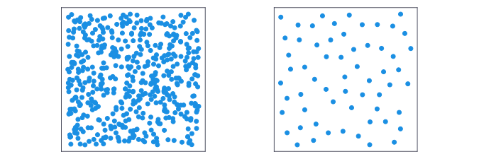
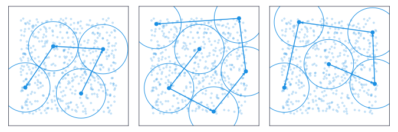
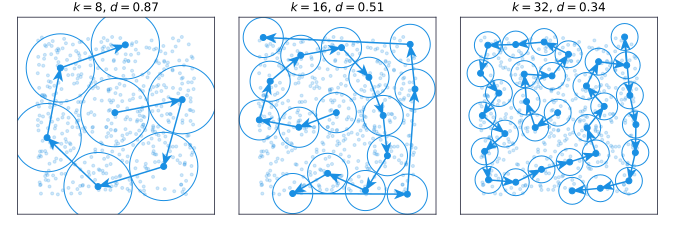



Applied machine-learning often requires reasoning about points in high-dimensional spaces, where distances encode some form of information. A few times now I've needed to summarize such semantically rich spaces using a very small subset of samples. In such cases, ideally you want samples that come from diverse, non-overlapping regions in the space, maximizing the information content per sample.

Symbolically, we can express this as an optimization problem of the following form:

$$
\begin{align}
    \underset{\mathcal{X}}{\operatorname{arg max}}\quad&\min\quad\{d(x, x^\prime)|x, x^{\prime}\in\mathcal{X}, x\not= x^\prime\}\\ &\text{s.t.}\quad|\mathcal{X}|=k
\end{align}
$$

Put otherwise, we want to find a subset $\mathcal{X}$ of size $k$, where the nearest neighbours are as distant from each other as possible. From the left image to the right.



While the chosen samples in the right image come from the left image, the points are nicely spread out. The sample does not exhibit clumpiness, and each region of the space is fairly represented.

As it happens, such problems crop up all over the place. Unfortunately, similar problems (e.g., the [maximally diverse grouping problem](https://grafo.etsii.urjc.es/optsicom/mdgp.html), [bin packing](https://en.wikipedia.org/wiki/Bin_packing_problem)) are understood to be NP-hard. Given that our dataset is going to comprise thousands or millions of datapoints, brute search is probably out of the question.

Then again, exact solutions are overrated. Can we find an approximation that is good enough, as quickly as possible?

## Space-Filling Designs

One area where we want maximally diverse subsets, is that of [experimental design](https://en.wikipedia.org/wiki/Design_of_experiments) in computer science. For example, when running a hyperparameter optimisation search, you'd like to avoid running costly experiments with too similar hyperparameters. Instead, initially you want to explore the space of possible values as much as possible before honing in on an optimum.

Experimental designs that maximize the diversity in responses like this, are often called 'Space-filling Designs'. The Wootton, Sergent, Phan-Ta-Luu (WSP)[^wsp-citation] algorithm prescribes a relatively simple method for deriving such a space-filling design from a candidate set of points:

```txt
1. Generate a set of N points
2. Compute the pairwise distance matrix between all N points
3. Choose a seed point and a minimal distance `min_dist`
4. Remove all points whose distance to the seed point is smaller than `min_dist`
5. Choose the point closest to the seed point whose distance is greater than `min_dist`
6. Make the chosen point the new seed point, and remove the original
7. Iterate steps 4-6 until no more points can be chosen
```

[^wsp-citation]: this was the closest citation I could find. The origins of the algorithm seems spread out over a series of different, independent papers, which is not too strange given its simplicity

We can easily implement something like this is Python. Assuming we have access to the pairwise distance matrix, and have an initial guess for `min_dist`, the code should look something like this[^jaxtyping],

[^jaxtyping]: `jtyping`, the import I use to annotate arrays is shorthand for the amazing [jaxtyping](https://docs.kidger.site/jaxtyping/) library. The general syntax is `dtype[type, "dimensions"]`. I find it massively increases the readability of numpy/pytorch/jax code. Consider checking it out

```python
def wsp_space_filling_design(
    min_dist: float,
    seed_point: int,
    dist_matrix: jtyping.Float[np.ndarray, " num_points num_points"],
) -> jtyping.Int[np.ndarray, " num_chosen_points"]:
    # A point should never be able to choose itself, so set diagonals to nan
    dist_matrix_ = np.copy(dist_matrix)
    np.fill_diagonal(dist_matrix_, np.nan)

    # Add the seed point to the list of chosen points
    chosen_points = [seed_point.squeeze()]

    cur_point = np.copy(seed_point)

    # Start the iterations
    while True:
        # Find all points points within a circle of radius min_dist around the current point
        points_within_circle = (dist_matrix_[cur_point, :] < min_dist).squeeze()

        # Eliminate those points from ever being chosen
        dist_matrix_[points_within_circle, :] = np.nan
        dist_matrix_[:, points_within_circle] = np.nan

        # If no points are able to be chosen, stop
        if np.all(np.isnan(dist_matrix_[cur_point, :])):
            break

        # Find the nearest neighbour that is not within that circle
        # Choose it as the next point
        nearest_outside_point = np.nanargmin(dist_matrix_[cur_point, :])

        chosen_points.append(nearest_outside_point)

        # Make sure the current point can no longer be chosen
        dist_matrix_[cur_point, :] = np.nan
        dist_matrix_[:, cur_point] = np.nan

        cur_point = nearest_outside_point

    chosen_points = np.stack(chosen_points)

    return chosen_points
```

We can nicely visualize this as below. You can identify each seed point as the only point without an incoming arrow. The arrows indicate the point chosen at each iteration, being the closest point at least `min_dist` away. The plotted circles have radius `0.5 * min_dist`, giving nicely 'packed' solutions. Two touching circles have points that are exactly `min_dist` away.



At the moment, the starting position has a significant effect on the overal structure of the different solutions, but this will decrease as the distance becomes smaller. To simplify things, from now on, I only use the point nearest to the origin, i.e. the  as the original seed point (right most figure).

## Binary Searching a Solution

While a WSP space-filling design gives us a subset that 'feels' right, it assumes access to the very quantity we're trying to solve for; the maxi-min distance. Ideally, we'd avoid a brute-force search over the entire range of possible distance values.

Since we have access to a set of candidate points though, we can do this efficiently by running a binary search over the list of unique pairwise distances, and then selecting the solution that best approximates our desired batch size $k$.

Specifically, for a sample of $N$ points, there are $\binom{N}{2}=\frac{N!}{2!(N-2)!}$ possible pairwise combinations, meaning with binary search, the solution can be found in

$$
\begin{align}
    \mathcal{O}\left(\log_{2}\frac{N!}{2!(N-2)!}\right)&=\mathcal{O}\left(\log_{2}\frac{N!}{(N-2)!}-1\right)
\end{align}
$$

time. Asymptotically, using [Stirling's approximation](https://en.wikipedia.org/wiki/Stirling%27s_approximation), this is roughly as expensive as sorting the distances list ($\mathcal{O}(N\log_2N)$). The extended algorithm looks something like this:

```txt
1. Gather a set of N candidate points
2. Compute the pairwise distance matrix between all candidates
3. Find all unique distances, and store as a sorted list
4. Binary search the list for a distance
5. For each distance, generate a WSP space-filling design
6. Stop the search once you find a WSP space-filling design that has $k$ points
```

Pythonically, this looks something like:

```python
def binary_search_min_dist(points, desired_batch_size, verbose: bool = True):
    # Pairwise distances
    dist_matrix = sklearn.metrics.pairwise_distances(points)

    # Find all the unique distances
    unique_dists = np.unique(np.ravel(dist_matrix))[1:]

    # Define the centroid point
    # This is where we start our search
    centroid = np.argmin(
        np.sum(np.abs(points - np.mean(points, axis=0)), axis=1), axis=0
    )

    # Initiate binary search parameters
    left = 0
    right = unique_dists.shape[0] - 1

    # Binary search through all possible distances
    i = 0
    while left <= right:
        # Binary search select current distance
        middle = left + (right - left) // 2

        # Get the minimum distance
        cur_min_d = unique_dists[middle]

        chosen_points = wsp_space_filling_design(
            min_dist=cur_min_d,
            seed_point=centroid,
            dist_matrix=dist_matrix,
        )

        if verbose:
            print(f"{i:>2d} | size={len(chosen_points):d}, d={cur_min_d:.6f}")

        # If the size of the selected is too small, decrease the distance
        # Also includes infeasible (length 0) solution case
        if desired_batch_size > len(chosen_points):
            right = middle - 1

        # If too large, increase the distance
        elif desired_batch_size <= len(chosen_points):
            left = middle + 1

        i += 1

    return chosen_points, cur_min_d
```

This leaves some room for customization. I don't actually use an early stopping criterion, as each iteration is fast enough that I can let the binary search complete. As established, the seed point impacts the final WSP space-filling design quite a bit. Here I only explore 1 solution per distance, but should your search budget allow for it, using a series of random points might lead to more accurate batch size estimates for each distance.

The following figure displays solutions for batch sizes of size 8, 16 and 32, all starting from the mean centroid. While the solutions are all pretty different, they exhibit a similar pattern. Initially the path snakes around the seed point, while at the end, larger and larger leaps are made to fit in some final points at the edges of the covered space.



## Next Steps & Limitations

While we've arrived at a relatively cheap method for generating subsets with reasonably spread out points, this approach does have some caveats. Currently, I've stuck with Euclidean distance, which gives rise to a nice geometric intuition (hence the figures), different distance metrics probably lose this. I'd image that the cosine or angular distances might work, which would effectively be choosing points based on their projection onto the unit circle. In a later paper , the same authors apply the WSP space-filling design algorithm to variable reduction, using the correlation matrix as a pairwise distance matrix.

So far we've been looking at points in a low-dimensional space (2D), whereas most applications have hundreds or thousands of dimensions. The cited paper  tests WSP space-filling designs against some alternatives in higher dimensions (up to 50D), and find it works favourably, but they never compare against the global optimum. Thus, truly high-dimensional spaces remain untested.

Finally, so far I've only looked at uniformly distributed points. This is probably the least realistic assumption, with the majority of embedding space necessarily introducing some form of clustering or manifold learning. The current approach is constrained to the set of observed points, so no subset will include points in 'no man's space'. In a sense, this ensures the subset respects the manifold.

However, in high-density regions it might be beneficial to use smaller distances locally than used globally, i.e. to focus on details. I'd assume this could be implemented by using some distances suited to non-Euclidean spaces, like the RBF kernel.

Another approach might be to explicitly compute a density estimate, sampling points inversely proportional to their density .

## Implementation

I've put a copy of the notebook used to generate these figures in a [public GitHub gist](https://gist.github.com/ioverho/2855e83edca1dd86e1860d7e0575bf17):



## References


